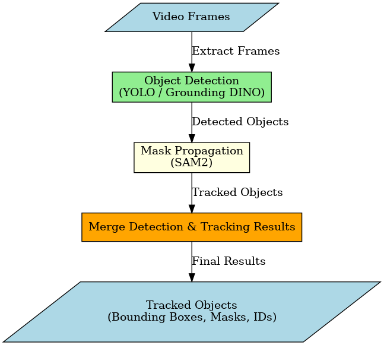

# DynamicSAM2: Video Object Tracking with SAM2 and Detection Models

[](https://opensource.org/licenses/MIT)
[](https://www.python.org/downloads/)
[](https://pytorch.org/get-started/locally/)

DynamicSAM2 is a framework for video object tracking that combines the segmentation capabilities of SAM2 (Segment Anything Model 2) with various object detection models, enabling robust tracking and segmentation of objects in videos.

<div align="center">
  
</div>

## Features

- Flexible integration with multiple object detection backends (YOLO, Grounding DINO)
- SAM2-based mask propagation for temporal consistency
- Confidence score tracking for detected objects
- Automatic merging of detection and tracking results
- Robust handling of object occlusions and reappearances
- Video visualization with tracked objects and masks
- Support for custom detection models

## Installation

### Requirements

- Python 3.8+
- PyTorch 2.0+
- CUDA (recommended for faster processing)

### Setup

1. Clone the repository:
```bash
git clone https://github.com/yourusername/DynamicSAM2.git
cd DynamicSAM2
```

2. Create a conda environment:
```bash
conda create -n dynamicsam2 python=3.8
conda activate dynamicsam2
```

3. Install the dependencies:
```bash
pip install -r requirements.txt
```

4. Download the checkpoint models:
```bash
python download_all_ckpts.py
```

## Quick Start

### Basic Usage

```python
import os
from pathlib import Path
from DynamicSAM2.object_detection import YOLODetectionModel, DinoDetectionModel
from DynamicSAM2.sam2_video_tracker import Sam2VideoTracker

# 1. Initialize a detector (YOLO or Grounding DINO)
# Option 1: YOLO detector
yolo_detector = YOLODetectionModel(
    model_path="yolov8x.pt",
    device="cuda",
    conf_threshold=0.3,
    iou_threshold=0.45
)

# Option 2: Grounding DINO detector
dino_detector = DinoDetectionModel(
    text_prompt="person, car, bicycle",
    device="cuda",
    box_threshold=0.35,
    text_threshold=0.25
)

# 2. Initialize the tracker
tracker = Sam2VideoTracker(
    video_path="path/to/your/video.mp4",
    detection_model=yolo_detector,  # or dino_detector
    output_dir="tracking_results",
    frames_dir="temp_frames",
    check_interval=10,
    device="cuda",
    target_fps=10,
    target_resolution=(1280, 720),
    save_masks=True
)

# 3. Run tracking
tracked_objects = tracker.process_video()

# 4. Access tracking results
for obj_id, obj_data in tracked_objects.items():
    print(f"Object {obj_id} (class: {obj_data['class']})")
    print(f"Appears in {len(obj_data['frames'])} frames")
    print(f"Average confidence: {sum(obj_data['confidence'].values()) / len(obj_data['confidence']):.3f}")
```

## Architecture

DynamicSAM2 combines object detection and mask propagation in a unified tracking framework:

<div align="center">
  
</div>

The system operates in three main stages:
1. **Detection**: Identifying objects using a detection model (YOLO/Grounding DINO)
2. **Propagation**: Tracking objects through video frames using SAM2
3. **Merging**: Combining detection and tracking results at check intervals

## Key Components

### Object Detection Models

- **YOLODetectionModel**: Uses YOLOv8 for general object detection
- **DinoDetectionModel**: Uses Grounding DINO for text-prompted object detection

### SAM2VideoTracker

The main class that coordinates the tracking process:
- Initializes detection and tracking models
- Processes video in chunks for efficient memory usage
- Merges tracking and detection results
- Maintains a dictionary of tracked objects with:
  - Bounding boxes per frame
  - Class labels
  - Confidence scores
  - Segmentation masks (optional)

## Advanced Usage

### Filtering by Confidence

```python
# Filter tracked objects by minimum confidence
min_confidence = 0.4
filtered_objects = {}

for obj_id, obj_data in tracked_objects.items():
    avg_confidence = sum(obj_data['confidence'].values()) / len(obj_data['confidence'])
    if avg_confidence >= min_confidence:
        filtered_objects[obj_id] = obj_data
        
print(f"Objects before filtering: {len(tracked_objects)}")
print(f"Objects after filtering: {len(filtered_objects)}")
```

### Custom Detection Model

You can implement your own detection model by inheriting from `BaseObjectDetectionModel`:

```python
from DynamicSAM2.object_detection import BaseObjectDetectionModel

class CustomDetector(BaseObjectDetectionModel):
    def __init__(self, model_path, device="cuda"):
        self.model = load_your_model(model_path)
        self.device = device
        
    def detect(self, image_path):
        # Implement detection logic
        # Must return: boxes, labels, confidences
        boxes = ...  # xyxy format
        labels = ...  # list of class names
        confidences = ...  # list of confidence scores
        return boxes, labels, confidences
```

### Visualization Options

You can customize the visualization by modifying the `VisualizationManager` parameters:

```python
from DynamicSAM2.visualization import VisualizationManager

# Create custom visualizer
visualizer = VisualizationManager(
    output_dir=Path("custom_vis"),
    logger=logger,
    draw_tracks=True,
    draw_labels=True,
    mask_alpha=0.5
)

# Use custom visualizer in tracker
tracker = Sam2VideoTracker(
    video_path="video.mp4",
    detection_model=detector,
    visualizer=visualizer,
    ...
)
```

## Performance Optimization

### Memory Usage

To reduce memory usage during tracking:
- Adjust `check_interval` to balance between tracking accuracy and memory consumption
- Set `target_resolution` to downsize high-resolution videos
- Enable CPU offloading with `offload_state_to_cpu=True`

```python
tracker = Sam2VideoTracker(
    video_path="high_res_video.mp4",
    detection_model=detector,
    check_interval=15,
    target_resolution=(960, 540),
    device="cuda:0",
    offload_video_to_cpu=True,
    offload_state_to_cpu=True
)
```

### Speed vs Accuracy

Adjust these parameters to balance between processing speed and tracking accuracy:
- `check_interval`: Higher values increase speed but may reduce tracking accuracy
- `target_fps`: Lower values reduce the number of frames to process
- `min_tracked_frames`: Controls filtering of short-lived detections

## Results Format

The `tracked_objects` dictionary has the following structure:

```
{
  object_id: {
    "frames": {
      frame_idx: [x1, y1, x2, y2],  # Bounding box coordinates
      ...
    },
    "class": "person",  # Object class
    "confidence": {
      frame_idx: 0.95,  # Confidence score per frame
      ...
    },
    "masks": {  # Optional, if save_masks=True
      frame_idx: binary_mask,
      ...
    }
  },
  ...
}
```

## Citation

If you use DynamicSAM2 in your research, please cite:

```bibtex
@misc{dynamicsam2,
  author = {Roni Goldshmidt},
  title = {DynamicSAM2: Video Object Tracking with SAM2 and Detection Models},
  year = {2024},
  publisher = {GitHub},
  journal = {GitHub Repository},
  howpublished = {\url{https://github.com/yourusername/DynamicSAM2}}
}
```

## License

This project is licensed under the MIT License - see the [LICENSE](LICENSE) file for details.

## Acknowledgments

- [Segment Anything Model 2 (SAM2)](https://github.com/facebookresearch/segment-anything) by Meta AI Research
- [YOLOv8](https://github.com/ultralytics/ultralytics) by Ultralytics
- [Grounding DINO](https://github.com/IDEA-Research/GroundingDINO) by IDEA Research
